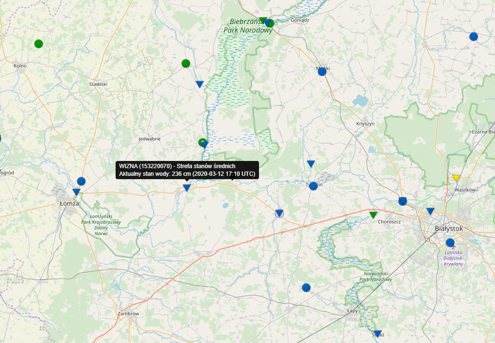

# Precipitation analysis with Time Series methods

The aim of this project is to optimise ARIMA model to predict precipitation (meteorological value) in town WIZNA by exploring the data characeristic and using grid search method. 

Precipitation, which is a subjest of this analysis, is a sum of monthly rain fall measured in milimeters. This value is measured on meteorological stations in Poland and one of them is located in town Wizna in north east Poland.

## Source of the data: Polish Institute of Meteorology and Water Management - National Research Institute

### Map 1. Wizna location

